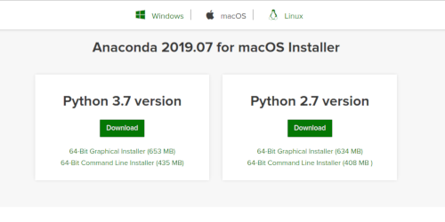
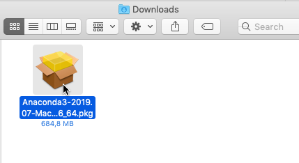
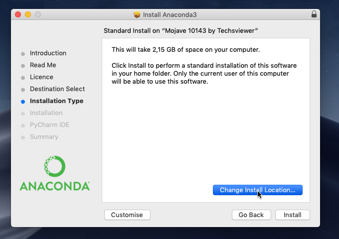
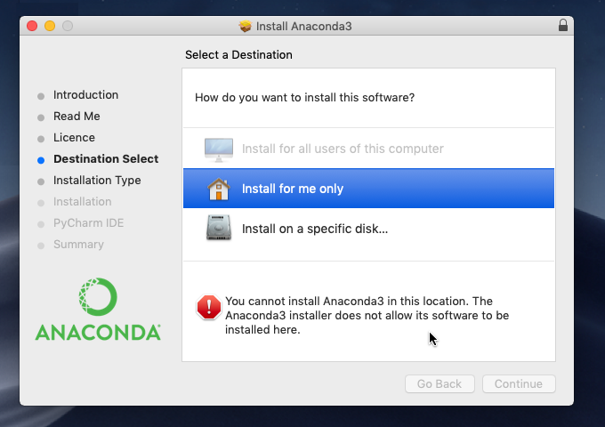
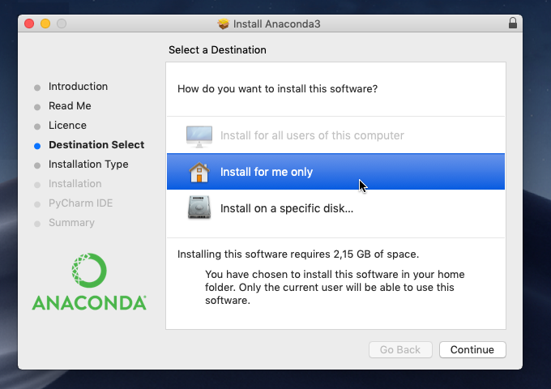
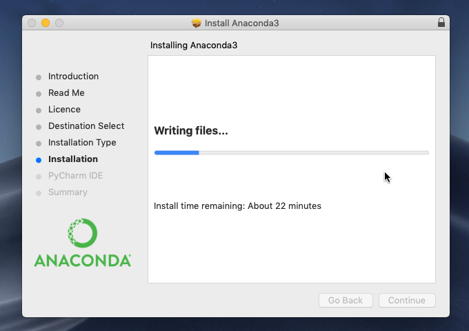
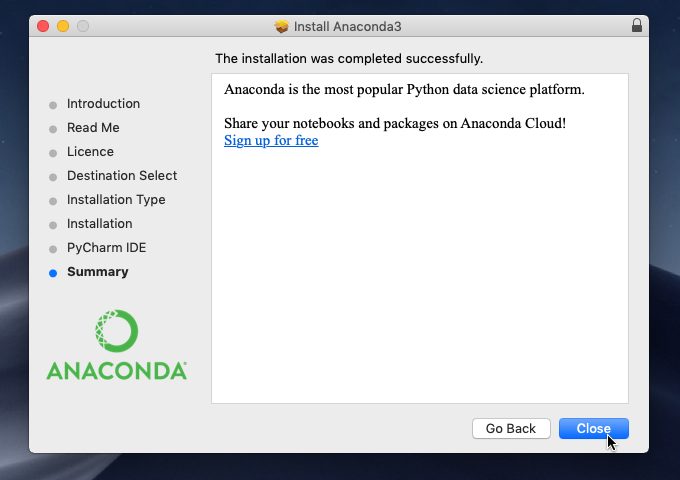
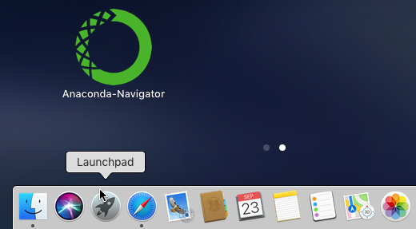

# Установка Anaconda для Mac
**(в картинках)**

Если [Анаконда](https://www.anaconda.com/) ещё не установлена на вашем компьютере, 
на сайте https://www.anaconda.com/distribution/ скачайте установочный файл для вашей операционной системы. 

> _Чтобы идти в ногу со временем, выбирайте версию для языка программирования Python 3.X
> (язык Python версии 2.X несколько отличается синтаксисом и уже считается устаревшим)._

Запустите загруженный файл .pgk.

 

Продвигайтесь по этапам, нажимая «Далее» (Continue).

 

На шаге «Тип инсталляции» (Installation Type) нажмите кнопку «Изменить местоположение» (Change Install Location)...

 

... и выберите «Установить только для меня» (Install for me only). 

 

Если появилось странное сообщение об ошибке, выберите другой пункт, а потом вернитесь к этому — сообщение об ошибке исчезнет.

 

Продвигайтесь далее к завершению установки.

 

Пока не увидите сообщение «Установка успешно завершена» (The installation was completed successfully).

 

По окончании удалите инсталлятор в корзину (Move to Trash).

 

В Launchpad появится Anaconda-Navigator.

 

Запустите его!
