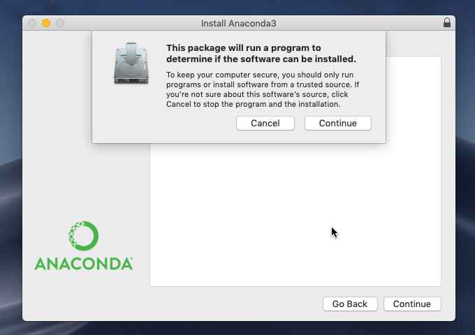
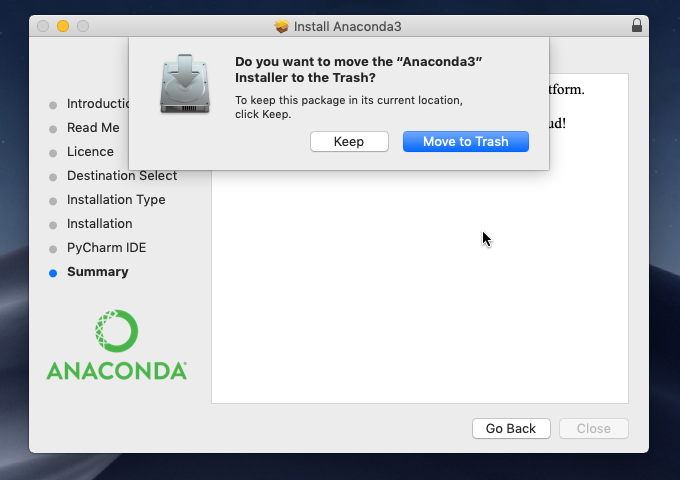
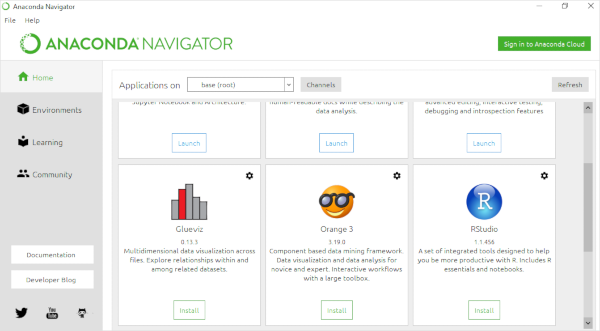

# Установка Anaconda для Mac
**(в картинках)**

Если [Анаконда](https://www.anaconda.com/) ещё не установлена на вашем компьютере, 
на сайте https://www.anaconda.com/distribution/ скачайте установочный файл для вашей операционной системы. 

> _Чтобы идти в ногу со временем, выбирайте версию для языка программирования Python 3.X
> (язык Python версии 2.X несколько отличается синтаксисом и уже считается устаревшим)._

Запустите загруженный файл .pgk.

 

Продвигайтесь по этапам, нажимая «Далее» (Continue).

 

На шаге «Тип инсталляции» (Installation Type) нажмите кнопку «Изменить местоположение» (Change Install Location)...

 

... и выберите «Установить только для меня» (Install for me only). 

 

Если появилось странное сообщение об ошибке, выберите другой пункт, а потом вернитесь к этому — сообщение об ошибке исчезнет.

 

Продвигайтесь далее к завершению установки.

 

Пока не увидите сообщение «Установка успешно завершена» (The installation was completed successfully).

 

По окончании удалите инсталлятор в корзину (Move to Trash).

 

В Launchpad появится Anaconda-Navigator.

 

Если кроме Python вам интересен язык «R», запустите Анаконда-Навигатор и установите RStudio.

### Что же мы установили?..
Anaconda — дистрибутив языков программирования Python и R. Его задача — поставить вам одним комплектом наиболее востребованные научным сообществом модули для этих языков (такие как NumPy, SciPy, Astropy и т.п.), попутно разрешая зависимости и конфликты, которые неизбежно будут возникать, если всё устанавливать с нуля и вручную. 

Анаконда включает оригинальный менеджер разрешения зависимостей conda с графическим интерфейсом Anaconda Navigator, который можно использовать вместо стандартного менеджера пакетов [pip](https://en.wikipedia.org/wiki/Pip_(package_manager) ). 

Для тех, кто предпочитает командную строку, основные команды Conda:

    conda search package_name  # искать пакет
    conda install package_name  # установить пакет
    conda install  # установка всего стандартного набора пакетов - более 150, около 3 Гб
    conda list  # список установленных пакетов
    conda update conda  # обновление списка пакетов
    conda clean -t  # удаление кеша - архивов .tar.bz2, которые могут занимать много места
    
### Если Anaconda-Navigator не работает

Перед тем как отчаиваться, запустите терминал и выполните в нем три команды:

    conda update conda
    conda update anaconda-navigator
    conda update navigator-updater

Если не помогло, выполните четвертую:

    anaconda-navigator --reset
