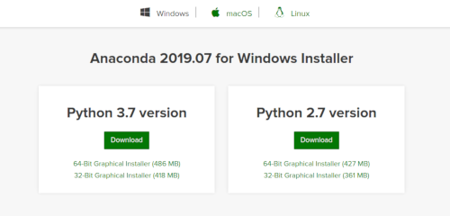

# Установка Anaconda для Windows
**(в картинках)**

Если [Анаконда](https://www.anaconda.com/) ещё не установлена на вашем компьютере, 
на сайте https://www.anaconda.com/distribution/ скачайте установочный файл для вашей операционной системы. 

> _Чтобы идти в ногу со временем, выбирайте версию для языка программирования Python 3.X
> (язык Python версии 2.X несколько отличается синтаксисом и уже считается устаревшим)._

Запустите скачанный файл и нажмите Next. 
> _Пакет Анаконда существует только в англоязычной версии, ведь учёные всего мира общаются преимущественно на английском._

Установка только для вашего пользователя полезна, когда вашим компьютером пользуются другие, и у них свои учетные записи.

Сделайте Python от Анаконды интерпретатором этого языка по умолчанию, если в вашей системе не установлен другой интерпретатор Python.

По окончании установки в меню «Пуск» появится соответствующий раздел, в котором среди прочего есть «Спайдер» (Spyder) — среда разработки на языке Pyhton, и «Джупитер Ноутбук» (Jupyter Notebook) — интерактивный блокнот для анализа данных.
> Как вы могли заметить, есть негласная традиция использовать сочетание «PY» в названиях программ на языке Python. 

Если кроме Python вам интересен язык «R», запустите Анаконда-Навигатор и установите RStudio.

### Что же мы установили...
Anaconda — дистрибутив языков программирования Python и R. Его задача — поставить вам одним комплектом наиболее востребованные научным сообществом модули для этих языков (такие как NumPy, SciPy, Astropy и т.п.), попутно разрешая зависимости и конфликты, которые неизбежно будут возникать, если всё устанавливать с нуля и вручную. 

Анаконда включает оригинальный менеджер разрешения зависимостей conda с графическим интерфейсом Anaconda Navigator, который можно использовать вместо стандартного менеджера пакетов [pip](https://en.wikipedia.org/wiki/Pip_(package_manager) ). 

Для тех, кто предпочитает командную строку, основные команды Conda:

    conda search package_name  # искать пакет
    conda install package_name  # установить пакет
    conda install  # установка всего стандартного набора пакетов - более 150, около 3 Гб
    conda list  # список установленных пакетов
    conda update conda  # обновление списка пакетов
    conda clean -t  # удаление кеша - архивов .tar.bz2, которые могут занимать много места
