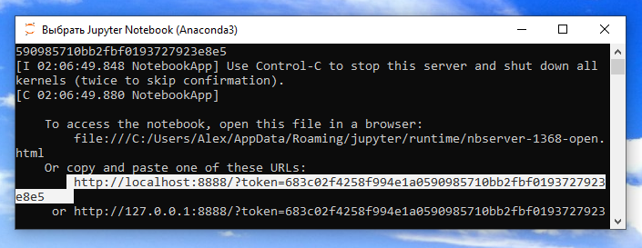
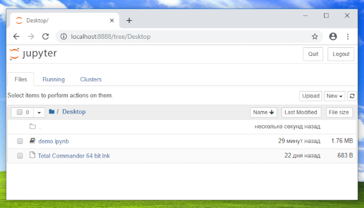
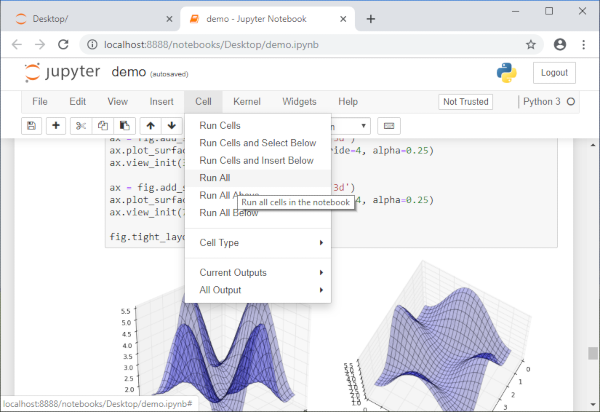
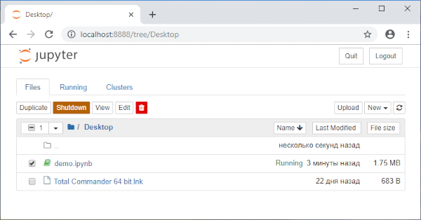

# Запуск Jupyter Notebook

JupyterNotebook сделан в виде веб-сервиса, работающего на вашем компьютере. Он запускается в окне с командной строкой,
но сам интерфейс программы доступен через веб-браузер по адресу http://127.0.0.1:8888. Если вы закроете окно с командной строкой,
то программа аварийно завершит свою работу.

> IP-адреса 127.X.X.X зарезервированы чтобы обозначать локальный хост (localhost),
то есть тот же узел сети, с которого происходит запрос к этому адресу.
То есть на любом компьютере IP-адреса 127.0.0.1, 127.1.2.3, 127.128.129.130 и т.п. указывают на него самого.

> После адреса компьютера следует порт 8888 сетевого протокола TCP.
Стандартный порт для веб-приложений имеет номер 80, и не указывается в веб-адресах.
Если порт отличается от 80, то его явно указывают через двоеточие после имени хоста.
Номер порта говорит операционной системе, с какой запущенной программой происходит обмен данными по сети.
Несколько программ не могут занять порт с одним номером.

Обратите внимание на параметр **token** в адресе, который появился в консоли.
Это случайная последовательность букв и цифр, которая нужна для авторизации.
Другие пользователи вашего компьютера (и другие хосты в сети) не смогут получить доступ к запущенному JupyterNotebook,
пока не узнают от вас значение token. 

> Учтите, что зная token можно получить доступ к любым файлам из профиля вашего пользователя.

Jupyter Notebook уже запущен. Чтобы увидеть его веб-интерфейс, скопируйте адрес из консоли и вставьте его в стоку адреса вашего любимого интернет-браузера. Рекомендуем использовать Chrome или Firefox.

Вы увидите интерфейс выбора файла блокнота, а в нем содержимое директории, 
из которой была запущена программа (по умолчанию — вашей домашней директории). 

Допустим, что нужный блокнот (файл с расширением .ipynb) находится на вашем рабочем столе (Desktop). Щелкните по названию файла чтобы запустить блокнот.

Блокнот состоит из ячеек, которые хранят программный код и результат его выполнения.
Чтобы перезапустить код во всех ячейках, в меню Cell выберите RunAll.

Jupyter Notebook держит в памяти состояние каждого открытого блокнота, то есть значения всех инициализированных переменных, подключённые модули и загруженные данные и т.п.
Экземпляр каждого открытого блокнота называется **ядром** (kernel).
Даже если вы закроете окно веб-браузера, запущенные блокноты останутся загруженными в оперативную память, а их ядра продолжат выполняться.
  
Иконки отрытых блокнотов зелёные. Чтобы выгрузить ядро блокнота из памяти, выберите запущенный блокнот и нажмите Shutdown.

Вот и всё, что нужно знать o JupyterNotebook для начала знакомства. 

А теперь откройте блокнот [demo.ipynb](./demo.ipynb) и поэкспериментируйте с его содержимым!
